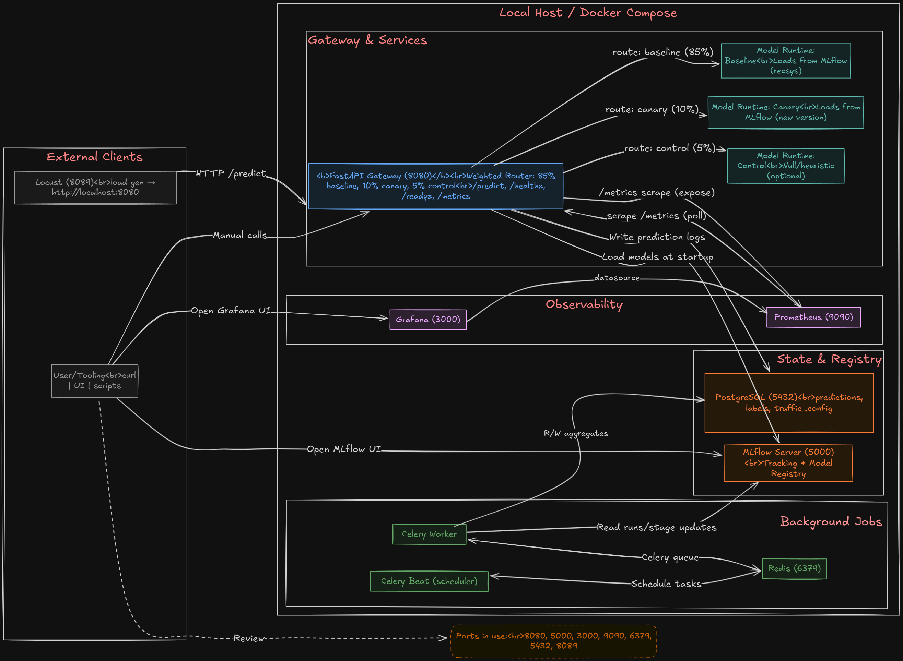
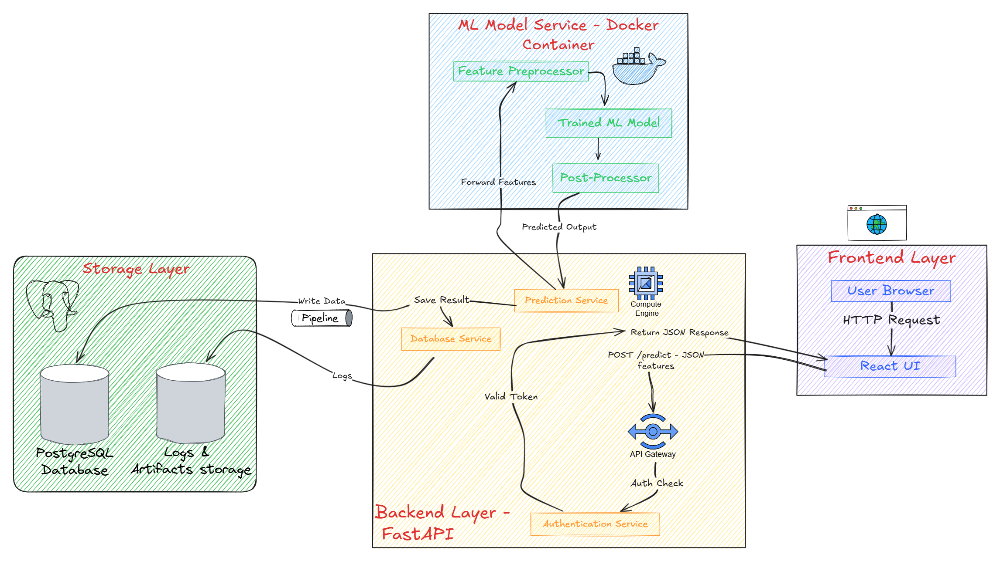
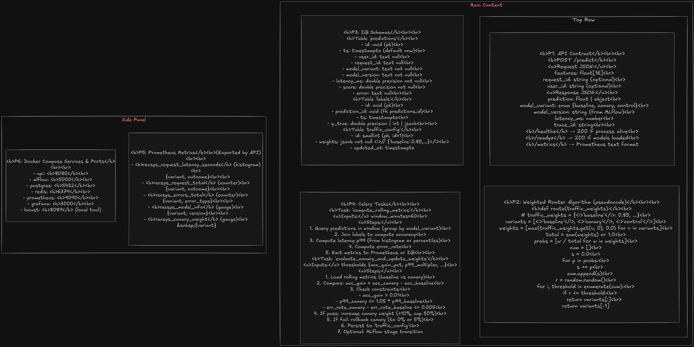
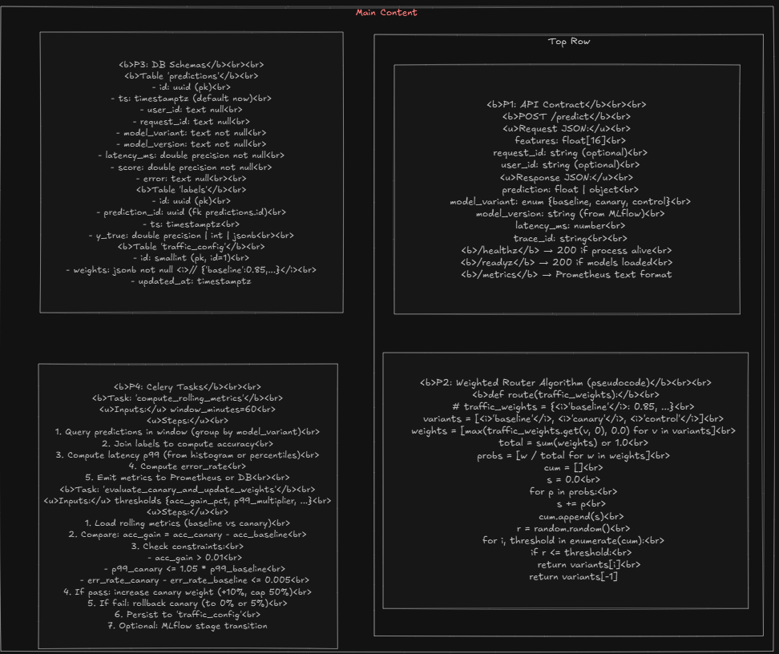
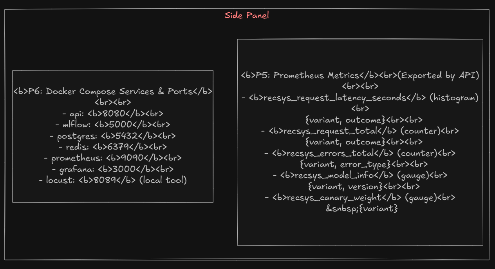

## Multi-Model Recommendation Serving (Local Canary + A/B)

This project is a production-inspired local system for serving multiple recommendation models with canary deployment and A/B testing. It includes:
- FastAPI gateway with weighted routing (baseline 85%, canary 10%, control 5% by default)
- MLflow tracking/registry for model versioning and stage management
- PostgreSQL logging for predictions and labels
- Prometheus metrics and Grafana dashboard
- Celery + Redis automation for canary promotion/rollback
- Docker Compose orchestration and Locust load testing



### Prerequisites
- Docker Desktop on Windows
- Python 3.11 (optional for running training locally)

### Quickstart
1) Start infra and services:
```powershell
scripts/dev.ps1 -Rebuild
```
This brings up postgres, redis, mlflow, api, worker, prometheus, grafana.

2) Train and register models (in a new terminal):
```powershell
$env:MLFLOW_TRACKING_URI='http://localhost:5000'
python scripts/train_and_register.py
```

3) Verify API:
```powershell
curl -X POST http://localhost:8080/predict -H "Content-Type: application/json" -d '{"features": [0.1,0.2,0.3,0.4,0.5,0.6,0.7,0.8,0.1,0.2,0.3,0.4,0.5,0.6,0.7,0.8]}'
```

4) Metrics and dashboard:
- Prometheus: `http://localhost:9090`
- Grafana: `http://localhost:3000` (anonymous)
- Dashboard: "RecSys Canary"

5) Load testing:
```powershell
pip install locust
locust -f scripts/locustfile.py --host=http://localhost:8080
```
Open `http://localhost:8089` and start swarm.

### Canary Automation
- A Celery beat job computes rolling 60m metrics and compares canary vs baseline.
- Promotion if: accuracy gain > 1% and p99 latency <= 1.05x baseline and error rate not worse by >0.5%.
- On success, traffic weights adjust; optional MLflow stage transitions.

### Configuration
- Traffic weights via env `TRAFFIC_WEIGHTS` or DB `traffic_config` (auto persisted).
- Model name via `REGISTERED_MODEL_NAME` (default `recsys`).

### Health
- Liveness: `/healthz`
- Readiness: `/readyz` (models loaded)
- Metrics: `/metrics`

### Repo Structure
- `services/api`: FastAPI gateway
- `services/worker`: Celery worker/beat
- `infra`: compose, prometheus, grafana
- `scripts`: training, synthetic data, locust
- `data`, `models`: placeholders for local artifacts


### Common Commands
```bash
make up         # compose up -d --build
make down       # compose down -v
make test       # run pytest
make fmt        # format with black/isort
make precommit  # run pre-commit hooks
```

### Notes
- This is a local demo; for prod, move MLflow backend to Postgres + S3 artifacts and deploy on K8s with KEDA/HPA, replace Docker Compose with Helm/Argo.
